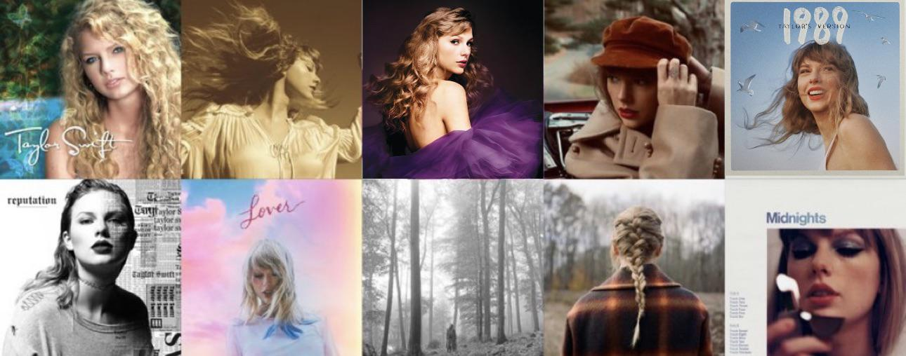

# Spotify x Musixmatch (Taylor's Version)
An unsupervised machine learning project using text analysis on Taylor Swift lyrical data.

The goal of this project is to build a machine learning model that can predict the theme of a Taylor Swift song based on frequently used words in only the first 30% of lyrics. Using data from Spotify API and Musixmatch API, where Spotify obtains its lyrical data, and implementing multiple techniques to yield the most accurate model for this unsupervised machine learning project, let’s dive into our text analysis.

[View here](https://anthonycu10.github.io/MLProject.html)

